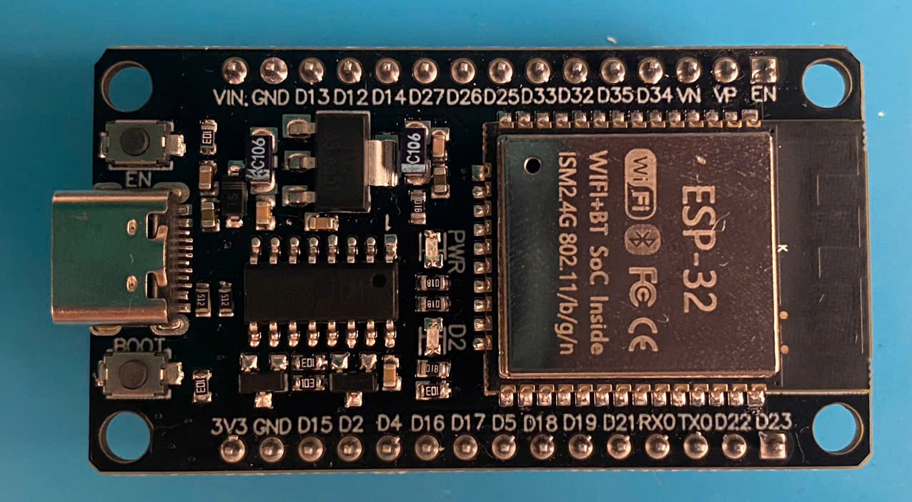
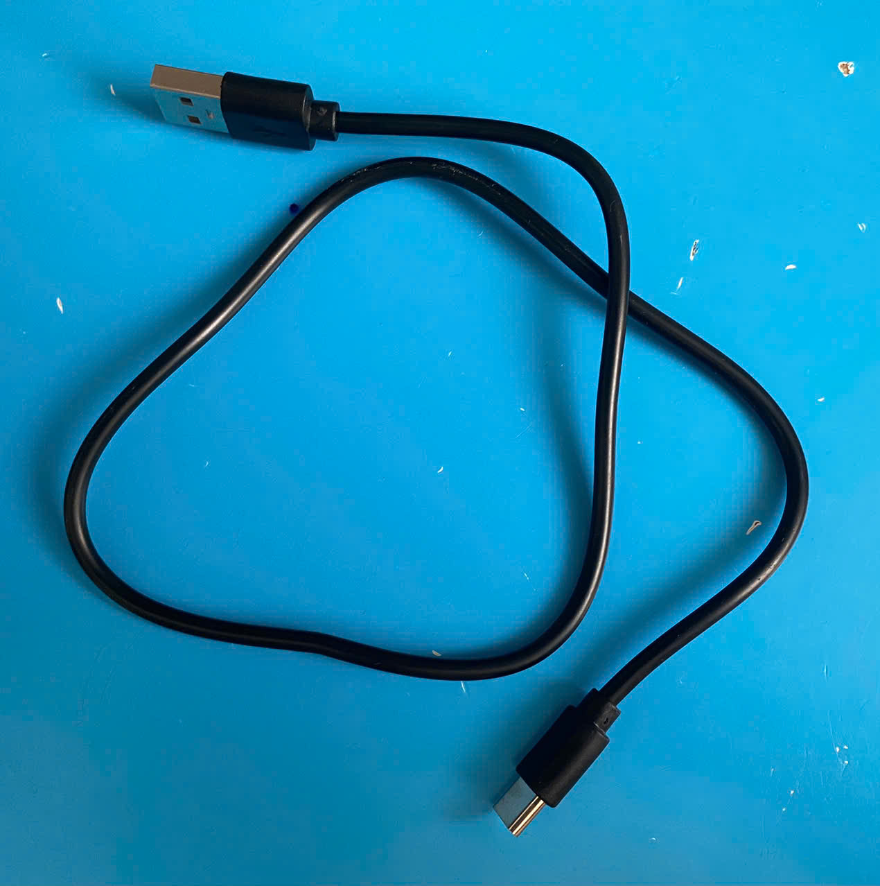

# Project 01: Nháy LED
> Chương trình đầu tiên và đơn giản nhất: Điều khiển đèn LED tích hợp trên bo mạch ESP32 nhấp nháy theo chu kỳ 1 giây. Giúp người thực hành làm quen với công việc lập trình ứng dụng để điều khiển thiết bị nhúng.

---

## 1. Tính năng
- LED trên board sáng tắt luân phiên trong thời gian 1 giây.

---

## 2. Linh kiện
- **ESP32 Development Board (30-pin, USB-C)**
- **Cáp dữ liệu USB Type-C** (đi kèm với board)

<details>
<summary>View images</summary>

*ESP32 Development Board (30-pin, USB-C):*

*Cáp dữ liệu USB Type-C:*


</details>

---

## 3. Công nghệ
- Phần mềm: **Visual Studio Code**
  - Extension: **PlatformIO**
  - Framework: **Arduino**
  - Thư viện: **Arduino.h**

---

## 4. Cấu trúc dự án
```
├───.pio
│   └───build
│       └───esp32dev
│           ├───FrameworkArduino
│           │   └───libb64
│           └───src
├───.vscode     
├───images
├───include
├───lib
├───src
└───test
```
- `.pio/`: kết quả build và cache của project này.
- `.vscode/`: cấu hình riêng của VS Code.
- `images/`: ảnh minh họa.
- `include/`: các file header của project.
- `lib/`: thư viện tự viết hoặc thư viện ngoài.
- `src/`: mã nguồn chính.
- `test/`: unit test nếu dùng PIO Unit Testing Framework.

---

## 5. Thực hiện
- Cắm dây USB vào máy tính và bo mạch ESP32.
- Mở folder dự án này bằng VS Code (đã cài PIO Extension).
- Nhấn nút mũi tên phải trên thanh công cụ phía dưới màn hình để biên dịch và nạp code.
- Quan sát kết quả.

---

## 6. Mình đã học được gì?
- Lỗi *'blink' was not declared in this scope*:  
  - Đưa hàm `blink` lên trước hàm gọi nó là `loop`  
  -> Hàm được gọi phải đứng trước hàm gọi trong mã nguồn.
- Sử dụng tư duy non-blocking thay vì hàm `delay` để viết code:
  - Việc đổi trạng thái LED (sáng - tắt) chỉ là một bước kiểm tra phụ trong mỗi lần lặp của hàm loop.
  - Mỗi lần chạy một vòng lặp, kiểm tra xem đã đến thời điểm cần đổi trạng thái đèn chưa và ra quyết định. Không dùng hàm delay để dừng toàn bộ chương trình của chip.