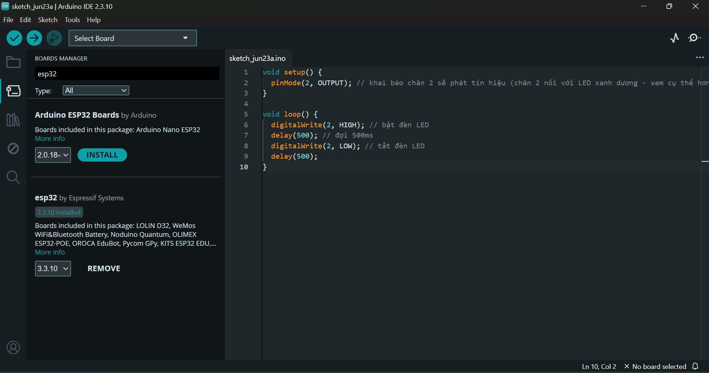
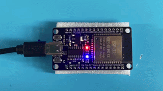

# Project 01: Blink LED

## 1. Mô tả
- Chương trình cơ bản nhất: Điều khiển đèn LED tích hợp trên bo mạch ESP32 nhấp nháy theo chu kỳ 1 giây để kiểm tra xem mạch có hoạt động bình thường hay không.

## 2. Linh kiện sử dụng
- **Mạch phát triển ESP32** (Tích hợp chip cầu chuyển đổi USB-to-UART CH340):

- **Cáp dữ liệu USB Type-C** (Dùng để cấp nguồn và nạp code):

## 3. Phần mềm sử dụng
- **Arduino IDE** (Đã cài đặt sẵn ESP32 Board Package):

## 4. Hướng dẫn thực hiện
1. **Kết nối phần cứng:** Cắm đầu USB-A của cáp vào máy tính và đầu USB-C vào cổng nạp Type-C trên bo mạch ESP32.
2. **Chuẩn bị mã nguồn:** Sao chép nội dung mã nguồn trong đường dẫn `src/main.cpp`, dán vào vùng làm việc (Sketch) trên Arduino IDE.
3. **Nạp code (Upload):** Nhấn biểu tượng mũi tên **Upload** để tiến hành biên dịch và nạp code vào chip.
4. **Mẹo xử lý phần cứng khi nạp:** Theo dõi cửa sổ *Output* bên dưới Arduino IDE. Khi màn hình xuất hiện dòng `Connecting...`, lập tức **nhấn và giữ nút BOOT** trên mạch ESP32, chỉ thả ra khi thấy dòng chữ chuyển sang `Uploading...` hoặc hiển thị tiến trình nạp `%`.
5. **Khởi động chương trình:** Sau khi quá trình nạp hoàn tất (xuất hiện dòng `Hard resetting via RTS pin...`), nhấn nút **EN (hoặc RST)** trên mạch để chip khởi động lại, kích hoạt chương trình mới và quan sát đèn LED trên mạch nhấp nháy.

*Kết quả thực hiện*