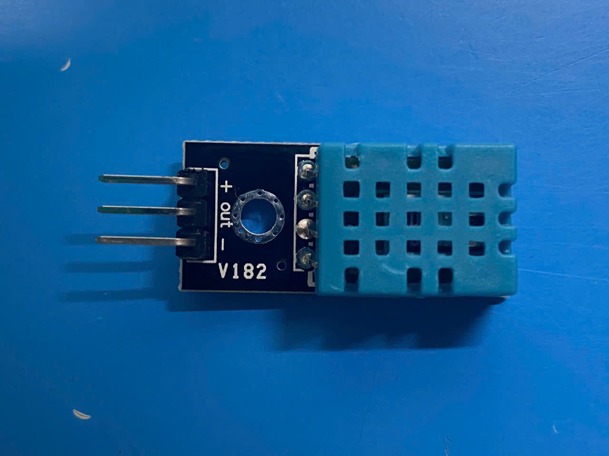
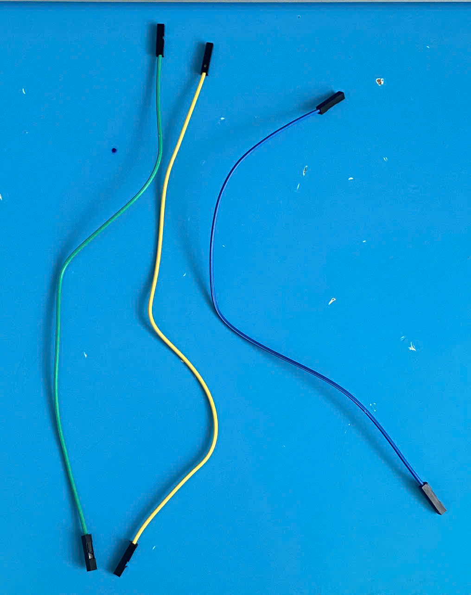
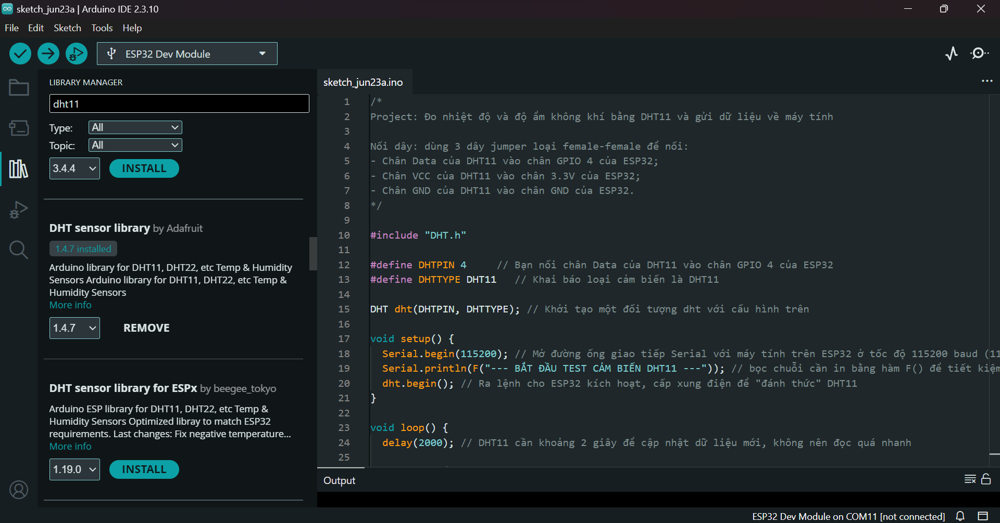
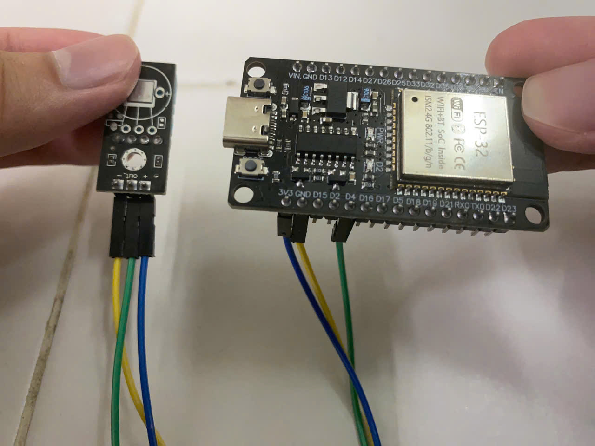
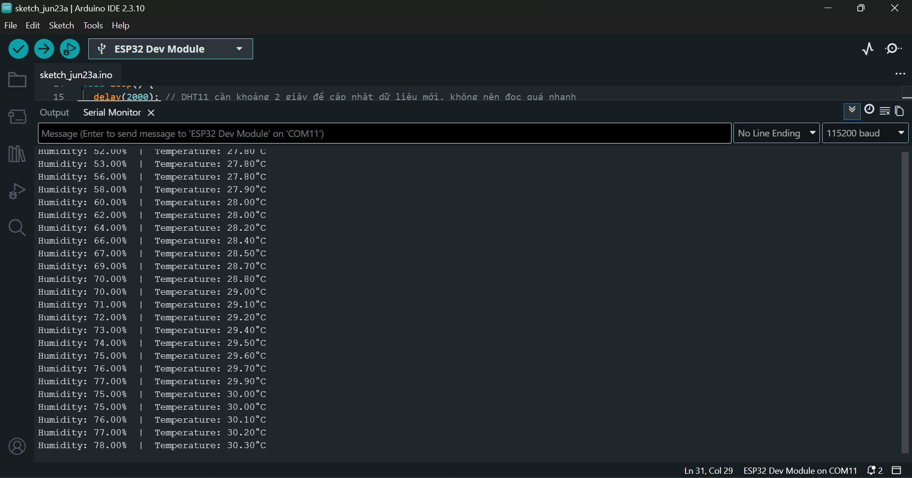
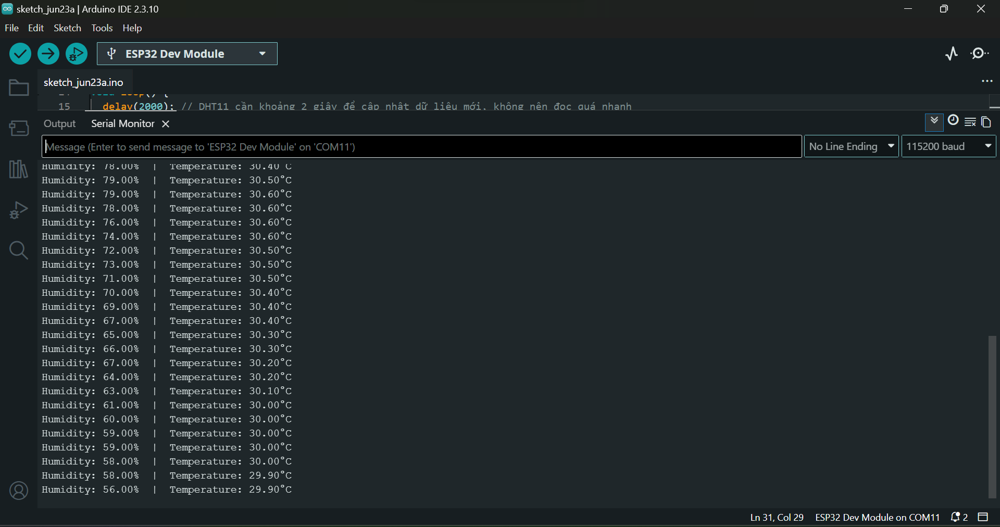

# Project 02: DHT11 Sensor Module

> Measure the temperature and humidity of the surrounding environment using the **DHT11 Sensor Module**, and send the measured data to the computer and display it on the `Serial Monitor` window for users to track every two seconds.

---

## 1. Components used
- 1 **ESP32 DevKit V1** (30-pin, USB-C, CH340)
- 1 **DHT11 Temperature and Humidity Sensor Module** (3-pin)  
- 3 **DuPont jumper wires** (F-F) 
- 1 **USB-A to USB-C cable**  

 View images 

*ESP32 DevKit V1 (30-pin, USB-C, CH340)*

*DHT11 Temperature and Humidity Sensor Module*

*3 DuPont jumper wires (F-F)*

*USB-A to USB-C cable*

---

## 2. Software tools
- **Arduino IDE** (with `DHT sensor library` (Adafruit) installed)  

View images

---

## 3. Wiring diagram
|DHT11 pin|ESP32 pin|Wire|
|:-:|:-:|:-:|
|+ (VCC)|3V3|blue jumper|
|out|D4|green jumper|
|- (GND)|GND|yellow jumper|

## 4. Implementation
- Copy the source code in `main.cpp`, paste it into the Arduino IDE sketch, and press the *Upload* button to flash it onto the ESP32 chip through the USB cable.
- While flashing, observe the `Output` windows. As soon as the sentence *'Connecting...'* appears, press and hold the **BOOT** button on the ESP32 board until the *'Uploading...'* sentence appears.
- The uploading process ends when you see the *'Hard resetting via RTS pin...'* sentence. After that, press the **EN** button to restart the chip with the newly-loaded program.
- Open the `Serial Monitor` tab by clicking on the magnifying glass button on the top-right side of the Arduino IDE window. Then observe the changing data sent back by the module and displayed on the monitor window every 2 seconds, while the sensor module is measuring the temperature and humidity of the surrounding environment.
- Try to test with many cases: hold the module more tightly, move it to hotter/colder areas, or increase/decrease the temperature around, etc.

*The testing result after gradually tightening the sensor module and then releasing it. We can see that when the temperature goes up, so does the humidity.*