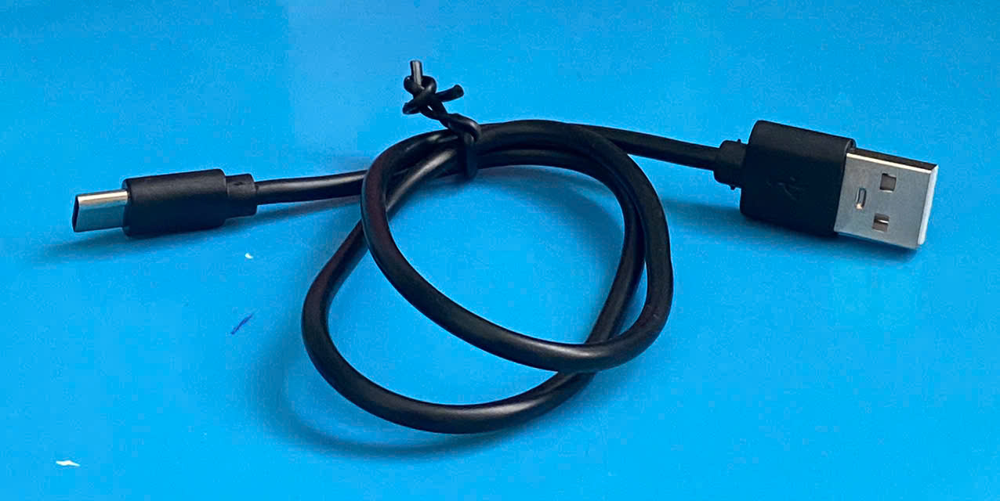

# Project 3: Web Server

> Make the ESP32 board connect to **Wi-Fi** and build a **Web Server** on it, which will perform the task of receiving requests from the user's browsers, handling them and sending back corresponding responses.

---

##  📌 Components
- 1 **ESP32 DevKit V1** (30-pin, USB-C, CH340)
- 1 **USB-A to USB-C cable**  

 View images 

*ESP32 DevKit V1 (30-pin, USB-C, CH340)*

*USB-A to USB-C cable*

---

## 💻 Software tools
- **Arduino IDE 2.3.10**

---

## 🛠 Implementation
- step 1...
---

## 📚 Some useful theory
### 1. Socket
Socket has many types of definition, depending on which context we are talking about:  
- In network theory, socket is an `endpoint` - the abstract concept which refers to the two endpoints on two sides of a data communication between two devices. 
- Regarding app programming, socket is an `Object` initialized from the *Socket Wrapper Classes*.
- Regarding memory management, socket is a `data structure` contained in a block of memory cells.

Regardless of which field, the ultimate duty of sockets is **storing the data that will support the communication between two devices** (IP of the device, Port of the service, Connection State, Socket Descriptor, etc.).